# Asking Direct Questions on Data

## Introduction

When you create a **Project** out of a **Data Set**, you have a blank canvas to start with.  
You can avoid _blank canvas syndrome_  using **BI Ask** to find the data and quickly visualize it.  
You can leverage the **BI ASK** feature using the _**Search Bar**_ on the _**OAC Home page**_.  
Use BI Ask to direct type your questions (using Natural Language) on data with your desktop/laptop or ask the same on your mobile, with Day by Day mobile app.

**BI Ask** (**N**atural **L**anguage **Q**uery **P**rocessing) promotes direct interactions between the users and the BI System to explicitly understand what every user is interested in.  
It interprets semantic layer, user private data, expression library and catalog artifacts and generates on-the-fly queries – visualizations.

_Estimated Lab Time:_ 40 minutes

### Objectives

- Use BI Ask to ask (or type) direct questions (Natural Language) on data - desktop/laptop
- Use BI Ask to ask direct questions (Natural Language) on data - mobil (Day by Day)
- Troubleshoot and Fine-Tune Searches

### Prerequisites

* An Oracle Cloud Free Tier or Paid account
* You should have completed  
    * Lab 1: Provisioning your Autonomous Database instance
    * Lab 2: Provisioning your Oracle Analytics Cloud instance
    * Lab 3: Connecting OAC to ADW and adjusting Data Set properties

## Task 1: Certify and Index your Data Set

1. **Search** for your Data Set.  
In order to ask questions using the Data Set, you need to **index** the Data Set to **enable the searching**, to choose a **Language** and  **Indexing Schedule**.  
In the **Oracle Analytics Home** page, click the **Navigator** on top left, and then click **Data**.  
Note: if you are still on the previous lab, you can quickly Go Back  to the **Home** page without saving the project  

   

2. **Select** your Data Set.  
   From **Data** page, select **Data Sets** section and identify or search for **DCA\_SALES\_DATA** Data Set.  
   Click the **Actions menu** of the data set or right-click the Data Set, and click **Inspect**

   
   

3. **Certify** the Data Set  
   From **General** tab click **Certify** button  
   
   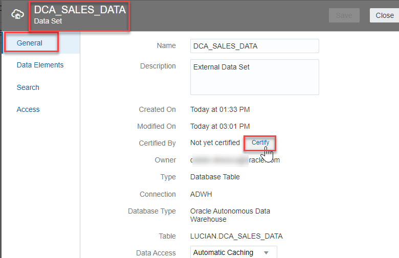

4. **Index** the Data Set  
   From **Search** tab click **Index Data Set for Searching**  
  
   

5. **Control access** (optional)  
   Access to the Data Sets can be controlled from **Access** tab  
  
   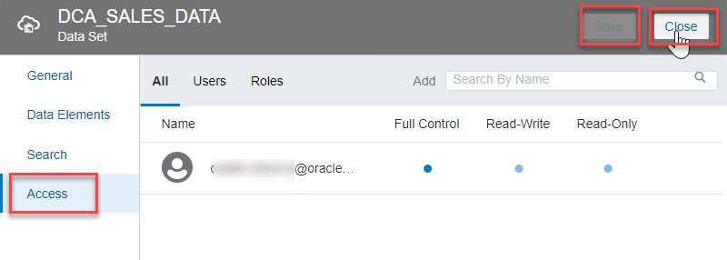  
   Note: best practice is to enforce control using **Roles** rather than individual **Users**

   Click **Save** and then **Close** button.

6. Go to **Home** Page
   Click **Navigator** and then select **Home**  
  
   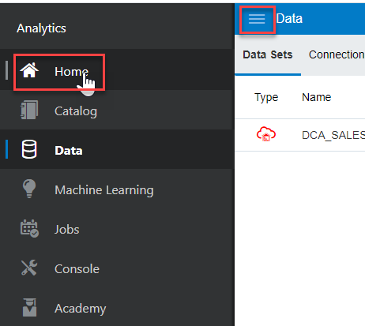

## Task 2: Ask Questions about your data

1. **BI Ask**.  
In the **Home** Page of OAC, a dialog bar appearing at the top can be leveraged to **ask** plain English language questions on the data.

2. Click the **Search** bar and **Type** in the bar area "**show me value by sales week**".  
   As you enter the information, the application returns search results in a drop-down list. The system can be searched by column names or data elements or both. Best fit results are returned immediately

3. Press **SHIFT + ENTER** to visualize data  
  
   

4. Check the results. Insights are rendered immediately from the best matching Data Set  
  
   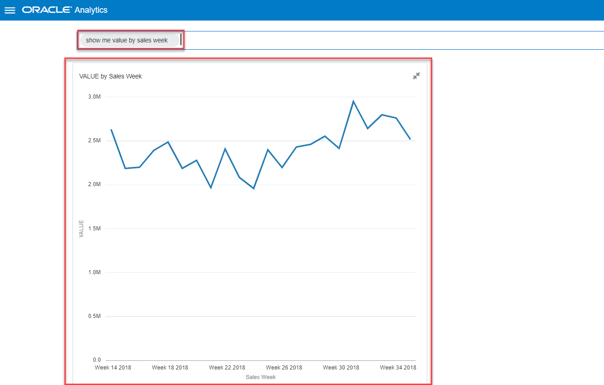

5. Continue to type in the bar area "**for customers**" and press **SHIFT + ENTER**  
   
   
   We observe that we are losing customers over time

6. Continue to type in the bar area "**for direct channel**" and press **SHIFT + ENTER**  
    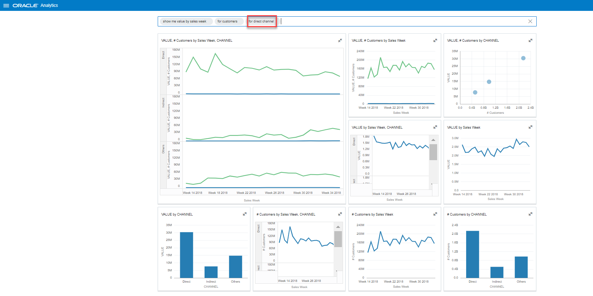

7. Remove the last query.  
    Select  "**for direct channel**" and press the x (remove) sign 

8. Continue to type in the bar area "**by channel**" and press **SHIFT + ENTER**  
   
   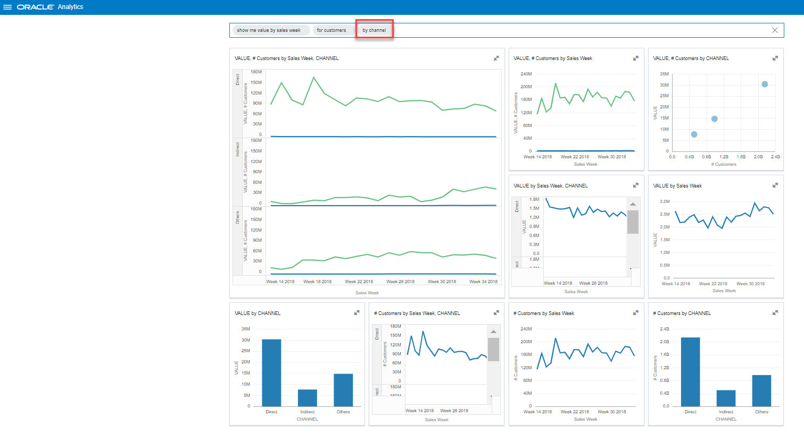

9. You have 9 visuals to start with. You can always choose one (or more) and explore it.  
    Note: optional you can select the first visual, hover over the top left of the visual and choose **Explore as Project** 

   

## Task 3: Day by Day

   We should be able to get our questions answered at anytime and anywhere even when we are on the go. We should be able to move from desktop to mobile seemly, ask the same questions, get the same results and more.

   **Oracle Day by Day** is an mobile analytic app that learns what you are interested in, when and where you are interested in it, and who you like to share and collaborate with. Start your day with a smart list of analytics that helps you make better decisions — day by day.

   **Oracle’s Day by Day** has been named a **winner** in the [Ventana Research 13th Annual Digital Innovation Awards](https://www.ventanaresearch.com/resources/awards/innovation#winners) in the category of **Analytics** for 2020.

   It's **supercharging BI Ask** with **context**. Understand who, what, when and where people are interested and eventually why.

   **Key Features**:  
    - Search based interface  
    - Natural Language Search  
    - Proactive delivery based on Time, Place and Threshold  
    - It will infuse analytics into a users daily activities, and not the other way around  
    - Collaboration with people and other apps

1. **Apps prerequisites**: **Install** Day by Day

2. **Search** for "**Oracle Day by Day**" app with Google Play or App Store 

   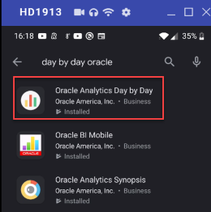  
    
3. **Install** Day by Day is nothing different from installing any of your casual mobile apps.  
     Don’t deny apps permissions right from the start; you can always go to your mobile app settings and work on permissions, if necessary.

4. **OAC prerequisites (Roles)**:  
Your **User** must have at least a **BI Content Author** and a **DV Consumer** Role.
   Note: that's enough for our lab (as you already have _BI Service Administrator_ Role and working on Data Set), but in a full enterprise environment you should also [Enable Data Model and Catalog Crawl](https://docs.oracle.com/en/cloud/paas/analytics-cloud/acabi/manage-how-content-is-indexed-and-searched.html#GUID-64DDEF84-75B8-4D0D-A625-17E9538435F0) for your User

5. In the **Oracle Analytics Home** page, click the **Navigator** on top left, and then click **Console**

   

6. From **Configuration** and Administration click **Users and Roles**
   Note: a new browser page is opening

   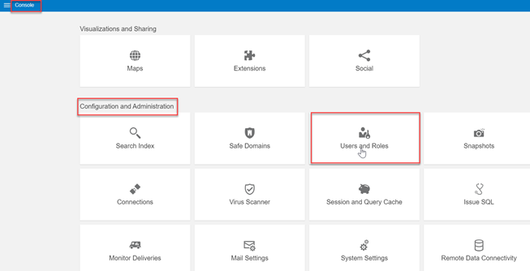

7. From **Application Role Management** search for your **User** in the search box upper right, then click on **Manage Application Role** 

   

8. From **Manage Roles** click **Search** button and see **Available Applications Roles**  
   if you already have **BI Service Administrator** role you are OK  

9. Double-click on **BI Content Author** and a **DV Consumer Role** to move it from the left side to the right side if necessary.  
Click **OK** button.  

   

10. Close the new opened browser page, return to the **Console**, click on **Navigator** and select **Home Page**.  

      

11.   **Connect** to your OAC instance  
The prerequisites are met, so it's time to connect your mobile to your OAC instance.  

12.   Enter your **Instance details**: (https<nolink>://name-tenency.analytics.ocp.oraclecloud.com)  

13.   Enter your **OAC login User Name** and **Password**; if you have enabled SSO in OAC, you have to set up [OAuth](https://docs.oracle.com/en/cloud/paas/analytics-cloud/biday/basics.html#GUID-4AE4B43-56F4-4DAC-8FF1-5FC4B5DE5BB)  
    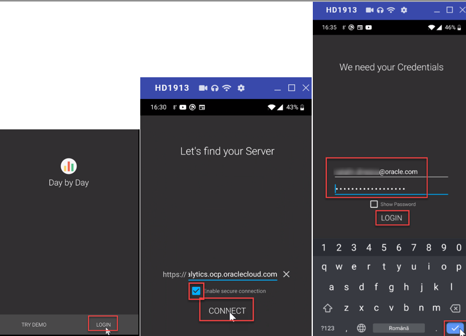

14.   **Ask** your **question**.  
You can simply speak or type in plain English questions, which gets directed to your data set

15.   Go to **Search** tab.  
Click on the microphone icon and speak “**show me value by week and customers by channel**”  
    Alternatively, you can type the same question
    Questions are parsed and reports are returned which best matches the question, from the best matched data set.  

16.   Search results are listed in this order:  
       1. Data model (semantic layer)  
       2. Certified Data Sets  
       3. Personal Data Sets  
       4. Catalog items (projects, analyses, dashboards, and reports)

      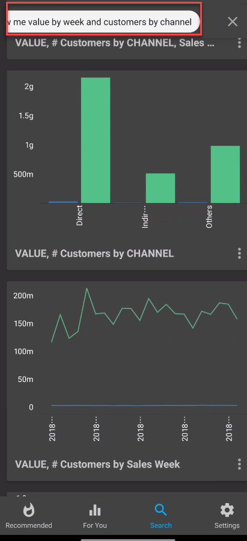

17.  **Add visuals** to your feed.  
Interesting visuals can be added to daily feeds. The daily feeds appear on the Home screen when the user logs in every time.  
Choose two visuals, click on the 3 dots and select **Add to Your Feed**.  

   

18.   **Comment**.  
Choose a visual, click on the 3 dots and select **Comments**. Speak or type “**Please review ASAP**”.  
    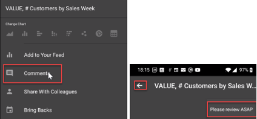
    Note: see “**1 comment**”  at the bottom of the feed

## Task 4: Troubleshoot and Fine-Tune Searches

This topic  briefly describes common problems and suggestions to fine-tune your searches.
1. **Connectivity** issues.  
If the app can’t connect to the server, then: 
      * Verify the URL format of the server in the app.  
   The URL format must be https://<nolink>hostname:port (for example, https<nolink>://oacserver.com:443)  
      * Run the Users Service End Point test.  
   Using a desktop browser, navigate to https<nolink>://oacserver.com:443/bimajel. A page with a link for the Users Service End Point test must be displayed  
      * Test the URL for the server in a browser on a computer. After confirming that the URL works properly in that browser, enter the same URL in a browser on the mobile device.  

2. **Certificate** issues.  
Be aware of warnings for bad certificates in the address bar and when loading a page on the desktop or on the mobile device

3. BI ASK Troubleshooting, **No Suggestions**

      * Check **ASK** on the Home Page and Verify it's returning suggestions.  
   Type in the ASK bar on the home page and verify that suggestions are returning.  
      * Verify that **Indexes** are Created  
   Verify that the index has but run for at least one subject area. **Run index** again in case it is corrupt.  
      * Verify **Security**.  
   User must be at least a BI Content Author and a DV Consumer. Make sure you are searching for a term that exists

4. **No Results** or **Missing** Results  
      * Check ASK on the Home Page**- Verify it Returns Suggestions.  
   Understand Matched vs Unmatched Terms.  
   Remember ASK on the desktop only supports matched terms, Day by Day supports either.  
   Unmatched terms may not always return what you expect.  
      * Verify Security  
   User must be at least a BI Content Author and a DV Consumer. Make sure you are searching for a term that exists

5. **App** Specific **Issues**  
      * **Notification** Issues.  
   Verify Notifications are Enabled  
        - Android – Settings | Apps | Day by Day | Show Notifications  
        - iOS - Settings | Day by Day | Notifications | Allow Notifications
      * Verify **Do Not Disturb** Options  
        - Android – Settings | Do Not Disturb  
        - iOS - Settings | Do Not Disturb
      * Test with a Simple Bring Back  
       - Do a quick search and set any card as a bring back in 2 minutes  
       - Send the app to the background lock the device and wait 2 minutes

6. **Location** Issues.  
      * Verify **Location Services** are **Enabled**  
        - Android – Settings | Apps | Day by Day |Permissions  
        - iOS - Settings | Day by Day | Location
       * Check for **Low Power Mode** or **WIFI Disabled**
      * Test with a Simple **Bring Back** by Location

7. **Other** Issues.  
      * Cannot **Upload Profile Image**  
       - Verify Camera and Photo Access  
       - Check Image Size (larger then 1 MB)

8. **Fine-Tune** Searches.  
      * Avoid **special characters** in your indexes, especially in terms from your subject areas  
      * **Don’t index any field** names whose value includes a large amount of text or confidential information  
      * Try to **flatten hierarchies** or avoid indexing hierarchies  
    * Minimize the number of **duplicate dimensions**  
      * Create **synonyms** to handle search queries.
       Please check [Configuring Synonyms for ASK Interface](http://oracledataviz.blogspot.com/2018/11/un-documented-beta-oac-1833-feature.html) blog
      * Expand **acronyms** because they aren’t easily understood when searching.  
   In a voice query, say “percent” or “percentage” rather than “p-c-t”.
      * Ensure that your **security** settings improve and personalize what users see  
      * Ensure that the administrator has **Certified the Data Sets** that users need to find

You have just finished to learn how to ask direct questions to your data using **BI Ask** in both the desktop and the mobile flavour as well as basic troubleshooting and index tips.  
* Optional: you can check in the next [video](https://youtu.be/uEESc7yo6kA) how BI Ask engine works with OAC DV and Day by Day in a side by side comparison 

You may now [proceed to the next lab](#next)

## Want to Learn More?

* [Troubleshoot Indexing](https://docs.oracle.com/en/cloud/paas/analytics-cloud/acabi/troubleshoot-indexing.html)
* [Using Search and BI Ask](https://docs.oracle.com/en/cloud/paas/bi-cloud/bilug/using-search-and-bi-ask.html#GUID-97F546AE-6277-45AB-B5A7-C55E2328AC0E)
* [Natural Language Interview with Jacques Vigeant](https://www.youtube.com/watch?v=piE1ah51DnE&feature=youtu.be)
* [Oracle’s Day By Day: Transforming The Way People Consume Analytics](https://blogs.oracle.com/analytics/oracle%e2%80%99s-day-by-day:-transforming-the-way-people-consume-analytics?source=:em:nw:mt:RC_PDMK190606P00196:OACBLOGJUL20WK4&elq_mid=168112&sh=15062418261323181322082406290313253035&cmid=PDMK190606P00196C0058)
* [Using Oracle Analytics Day by Day](https://docs.oracle.com/en/cloud/paas/analytics-cloud/biday/basics.html#GUID-8D2A7AA1-37E0-4862-9FD9-DEE1179E5D69)

## **Acknowledgements**

- **Author** - Lucian Dinescu, Product Strategy, Analytics
- **Contributors** - Sébastien Demanche, Cloud Center of Excellence
- **Reviewed by** - Shiva Oleti, Product Strategy, Analytics 
- **Last Updated By/Date** - Lucian Dinescu, April 2021
