# Building simple Interactive Analysis

## Introduction

In this lab, you will start creating your first simple interactive analysis, use filters, projects and basically further investigate why we are losing customers from mobile phones.

_Estimated Lab Time_: 20 minutes

### Objectives

- Start your first simple interactive analysis

### Prerequisites

* An Oracle Cloud Free Tier or Paid account
* You should have completed  
    * Lab 1: Provisioning your Autonomous Database instance
    * Lab 2: Provisioning your Oracle Analytics Cloud instance
    * Lab 3: Connecting OAC to ADW and adjusting Data Set properties
    * Lab 5: Gaining Insights with Visual Data Dialog
    * Lab 6: Monitoring and Ad-hoc scaling up ADW activity for optimal OAC experience

## Task 1: Start your first analysis

Lets Start from the previous project and clean up the report a bit.

1.  Remove **VALUE** from Grammar Pane Value (Y-Axis).  
Hover the mouse over the **VALUE** and click the 'x' sign.

    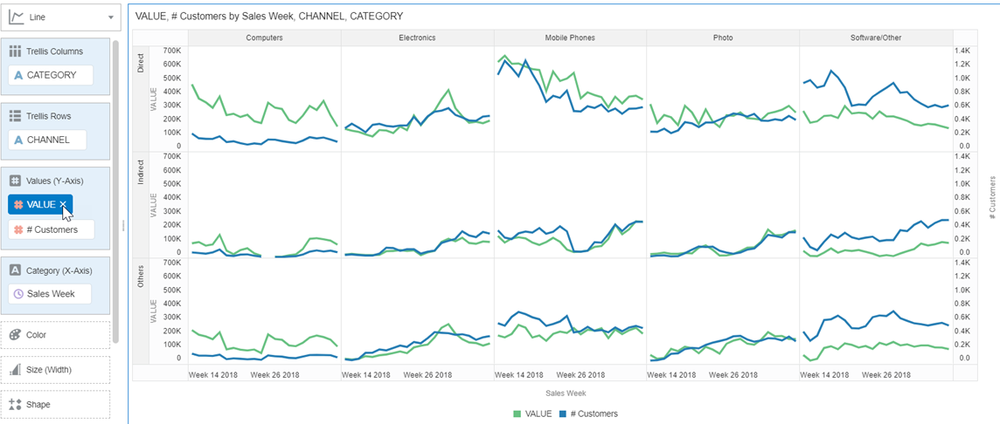

2.  **Add Trend Line**.  
In the Properties Pane select the **Analytics** **icon** and double-click **Add Trend Line**.

     _Click on the **Refresh Data** button in the trend line doesn't appear automatically._

    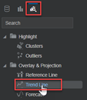

3.  **Rename** Canvas.  
Right-click the canvas tab and select  **Rename**.

    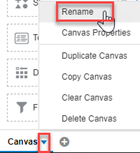

4.  Rename the canvas as **Overview**.  
Type in **Overview** and Click on the 'blue' check mark.

    

5.  **Duplicate** Canvas.  
Right-click the canvas tab and select  **Duplicate**.  
This adds a copy of the selected canvas to the project’s row of canvas tabs.

    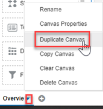

6.  Lets filter on Mobile Phones.   
Right Click **Mobile Phones** Category and select **Keep Selected**.  
That keeps only the selected members and remove all others from the visualization and its linked visualizations.

    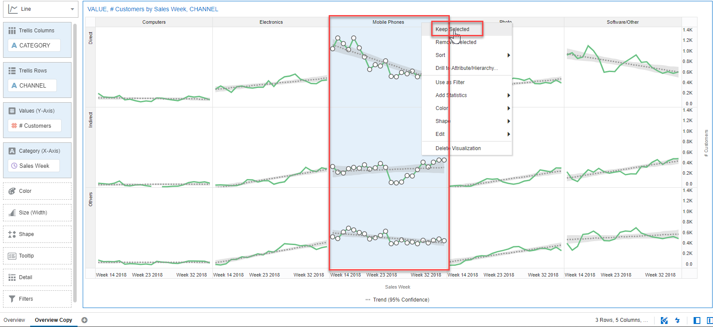

7.  Move **Channel** to Color.  
Drag **CHANNEL** from Trellis Rows section and Drop it to **Color** section.

    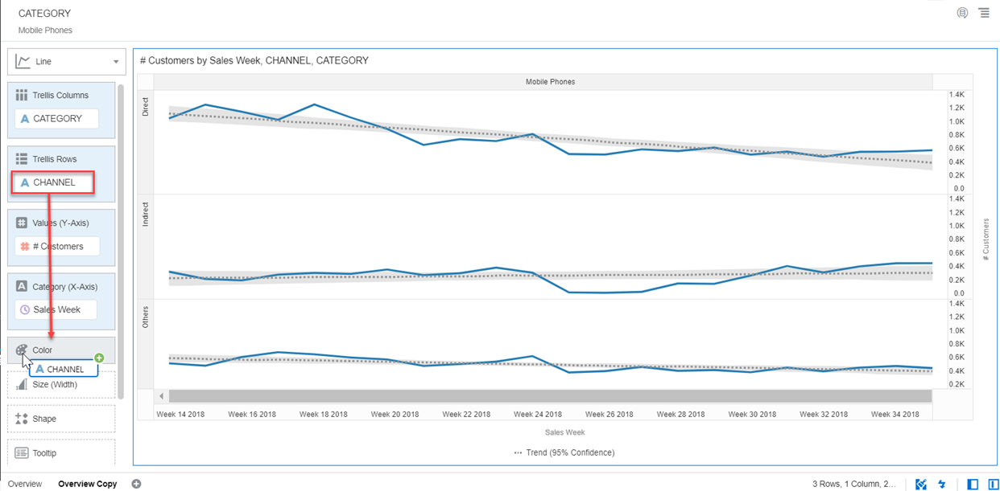

8.  Lets **Remove** the trend line for the sake of simplicity.  
Go Analytics Property Pane > Trend and click x.

    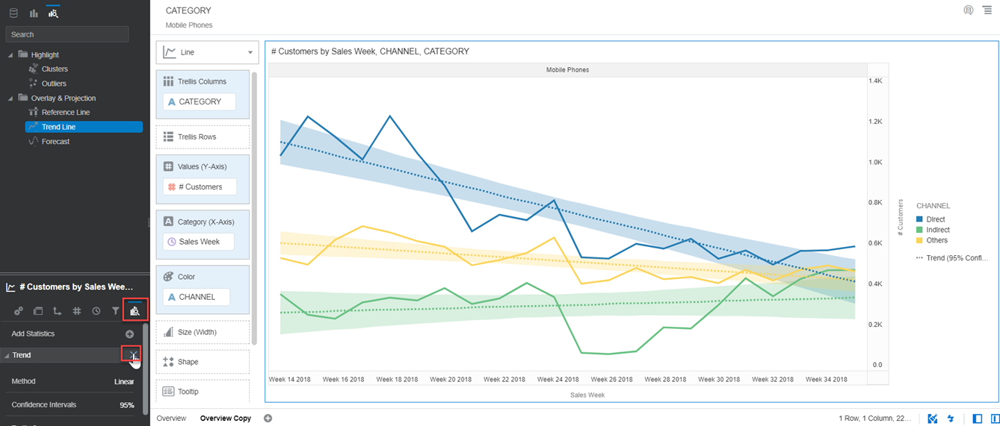

     _Click on the **Refresh Data** button in the trend line doesn't disappear automatically._

9.  Lets **Drill** on Direct Channel to SUB\_CATEGORY.  
Click first on the Direct Channel value (in the legend), hover the mouse on Channel Direct
Right Click > **Drill to Attribute/Hierarchy** and select Data Elements > **SUB\_CATEGORY**.  
This Drill to [Attribute Name] to directly drill to a specific attribute within a visualization.

    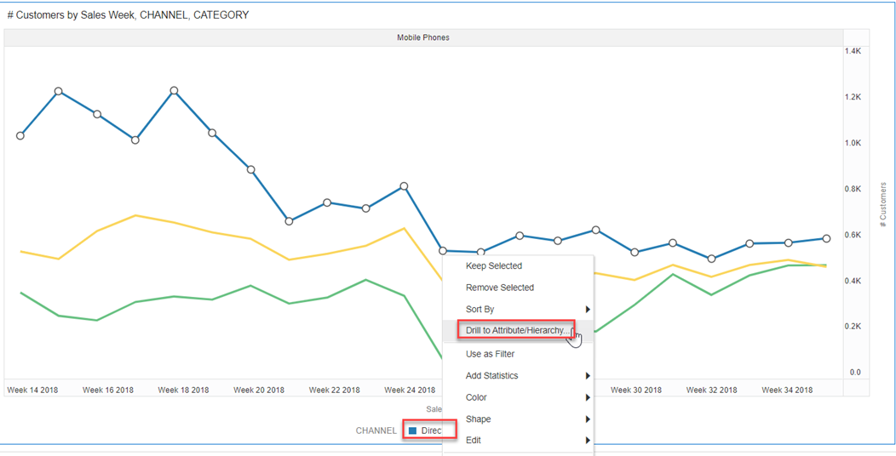  
    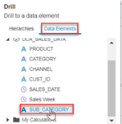

10.  Select _Sales Week_ on Category (X-Axis) and _Sub Category_ on Color

     Lets look at the results for 'Customers by Sales Week and Subcategory'.

     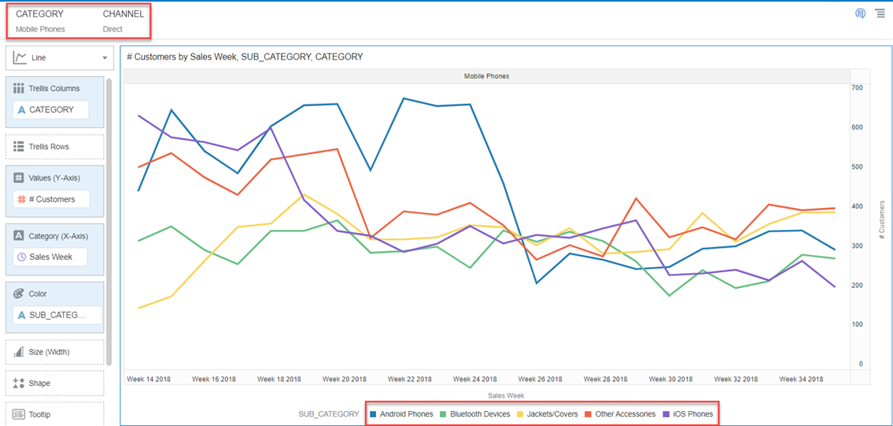

11.  Lets analyze customers across various sub categories and choose the **Create Best Visualization** option.  
Go to **Data Panel**,  Select **# Customers**, press CTRL key and Select  **SUB\_CATEGORY**; Right Click and select **Create Best Visualization**  
A visualization is automatically created on the canvas, and the best visualization type is selected based on the preconfigured logic. The selected data element is also positioned on a specific area of the Grammar Panel.

     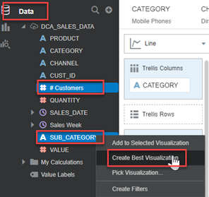

12.  The system decided that Bar Chart was the best viz type to visualize this information.

     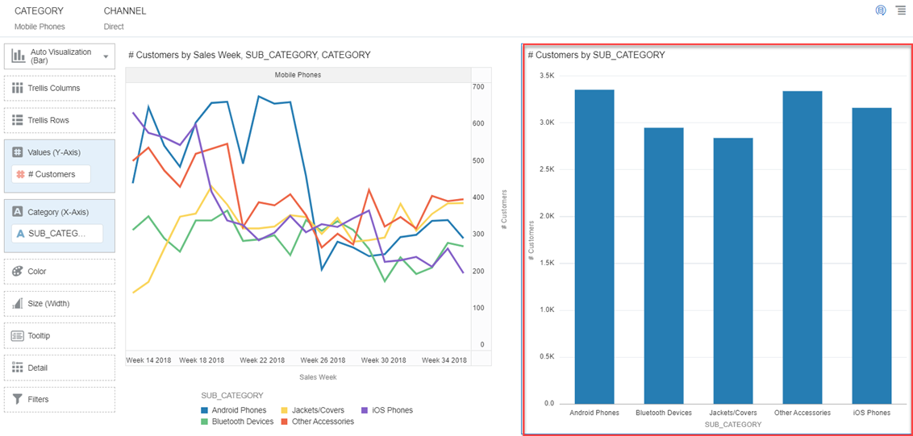

13.  Changing the chart type is very easy.  
Click on Grammar Pane Visualization type  and select **Donut** chart.

     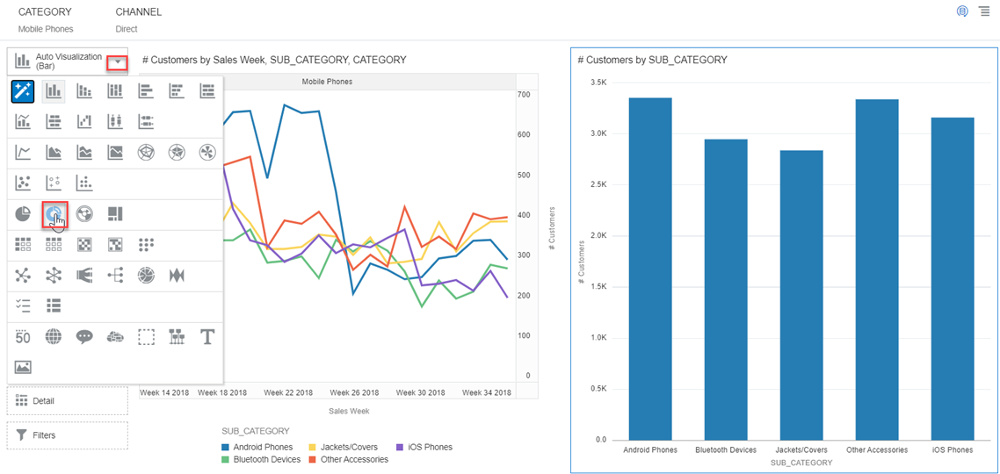

14.  Move **SUB_CATEGORY** from **Category** section to **Color** section.

     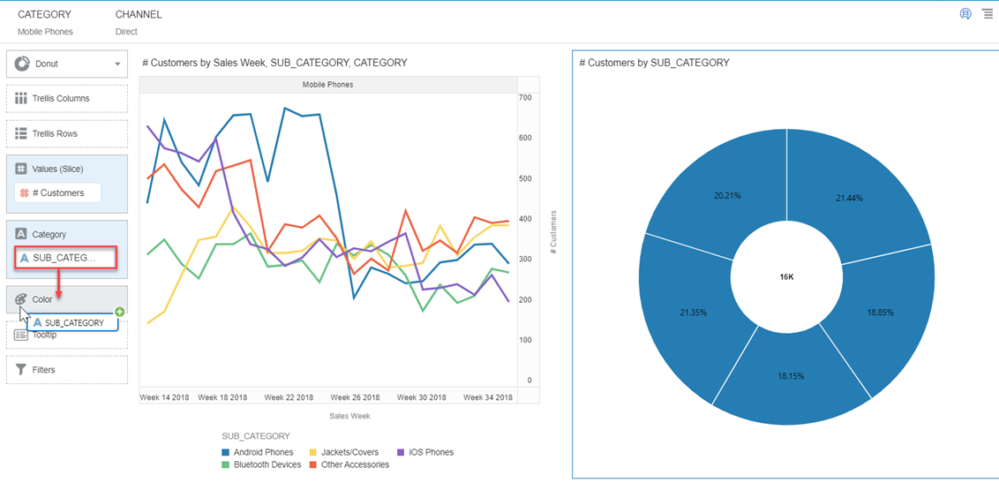

15. Chart properties can be modified here.  
Go to **Property Pane**, **Values** tab and change **Data Labels** from Percent to **Percent**, **Value** and **Label**.

     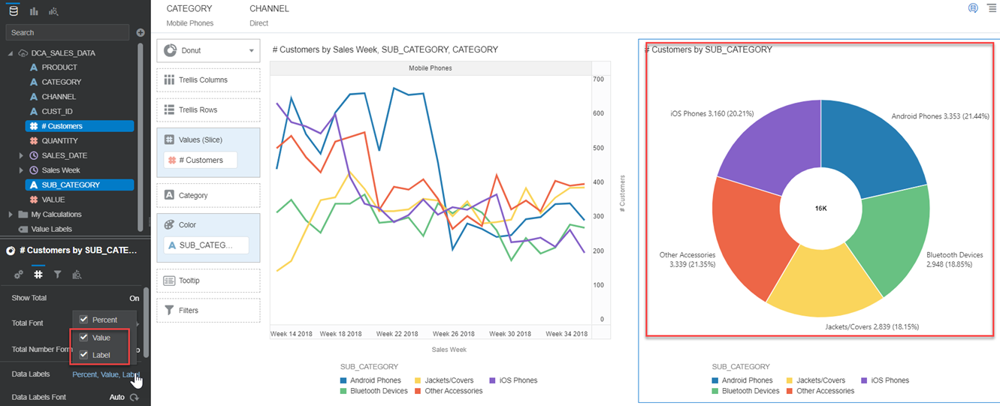

16.  **Change** Visualization from Donut to **Treemap**.  
Click on Grammar Pane Visualization type  and select **Treemap** chart.

     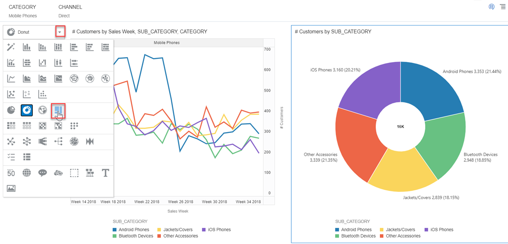

17.  Remove legend from the Treemap Visualization.  
Go **Property Pane**, click **General** tab, **Legend Position** element and select **None**.

     

18.  Change back to **Donut**.
Click on Grammar Pane Visualization type  and select **Donut** chart again.
     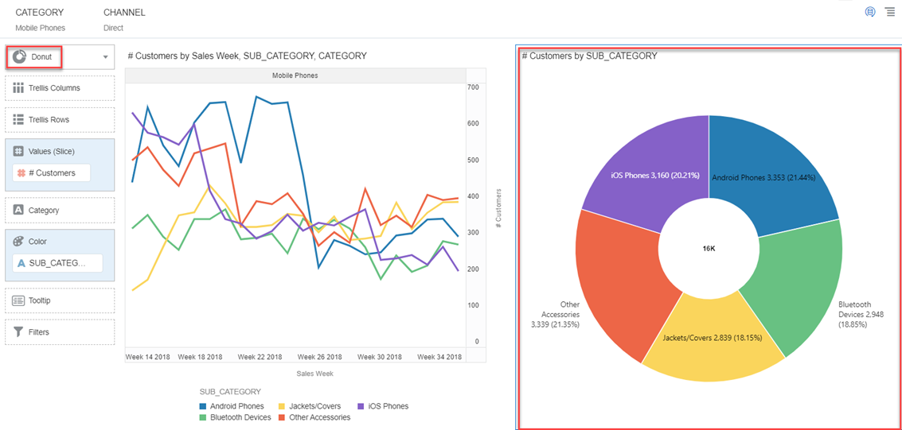  
     > notice there is no legend displayed this time

19. Use a **Visualization** **as a Filter**.  
You can configure a visualization to filter other visualizations on the canvas.  
Select Donut visualization, Right Click and select **Use as Filter**.
     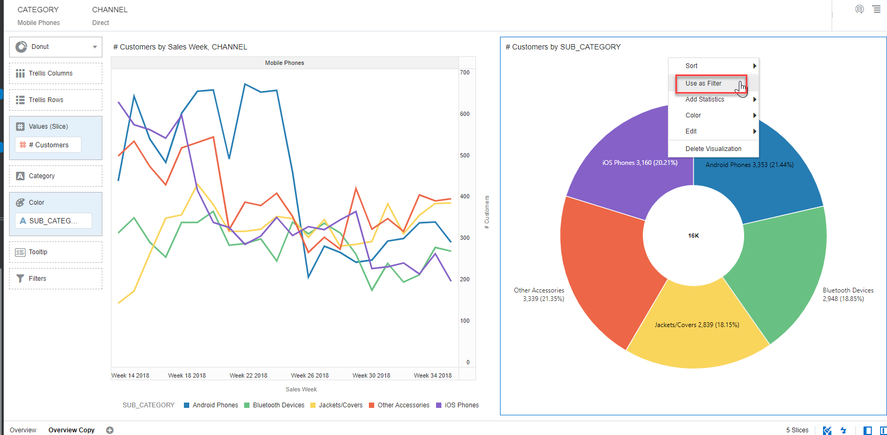

20. Experiment with Visualization as a Filter.  
Click on a different slice of the Donut visualization and notice the change in the first visualization.
     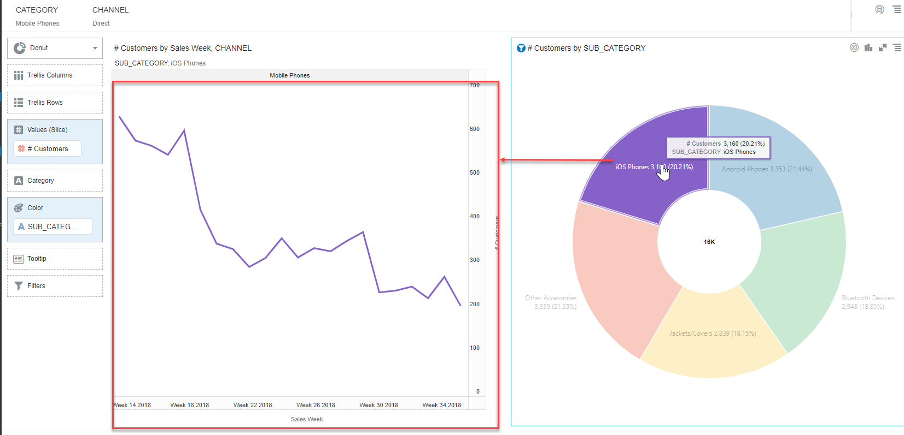

21. Remove Use as Filter.  
Select the Donut Visualization, Right Click and deselect **Use as Filter**.
     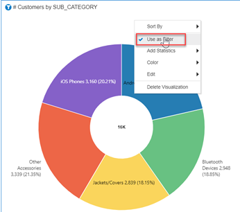

22. Delete **CHANNEL** Filter.  
Go to the **Filter Menu**, hover over CHANNEL, Click on the small down arrow and Select **Delete**.
     

23.  Rename the canvas as **Phones**.  
Type in **Phones** and Click on the 'blue' check mark.

     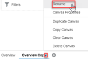

24.  **Duplicate** Canvas.  
Right-click the canvas tab and select  **Duplicate**.  
This adds a copy of the selected canvas to the project’s row of canvas tabs.

     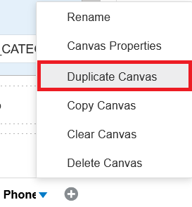

25. Lets filter out the data to those sub categories where we are losing maximum customers - iPhones and Android phones.  
Select **SUB_CATEGORY** from Data Pane and Drag and Drop it to **Filter area** .
     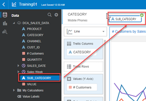

26. Select Android Phone and iOS Phones.  
Click **Android Phone** and **iOS Phones** (they will be moved to **Selections** tab). Click anywhere in Filter area.

     

27. Filter **CHANNEL**.  
Go to Data Pane, select **CHANNEL** and drop it to Filter area.
     

28. Select **Direct** Channel.  
Click **Direct** (there will be moved to **Selections** tab). Click anywhere in Filter area..
     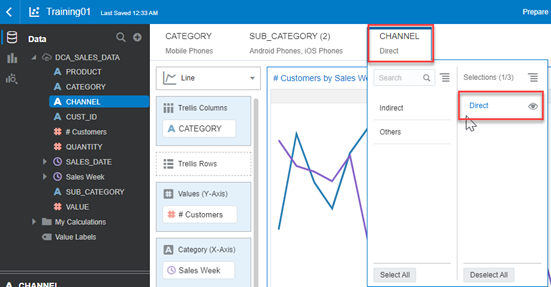

29. Delete **CHANNEL** Filter.  
Go to the **Filter Menu**, hover over CHANNEL, Click on the small down arrow and Select **Delete**.
     

30. Click on the **Save** button to save the project

You have just finished learning how to create your first analysis, use filters and building new canvases by reusing the previous content.

You may now [proceed to the next lab](#next)

## Want to Learn More?

* Free [Udemy: Modern Data Visualization with Oracle Analytics Cloud](https://www.udemy.com/augmented-analytics/), Section 2: Build Your First Data Visualization Project with Oracle Analytics

## **Acknowledgements**

- **Author** - Lucian Dinescu, Product Strategy, Analytics
- **Contributors** - Sébastien Demanche, Cloud Center of Excellence
- **Reviewed by** - Shiva Oleti, Product Strategy, Analytics
- **Last Updated By/Date** - Lucian Dinescu, April 2021