# Mashing up additional Data Sets, Contextual Data Preparation

## Introduction

In this lab, you will learn about mashing up Data Sets. You can blend data from one data set with data from another data set.

_Estimated Lab Time_: 15 minutes

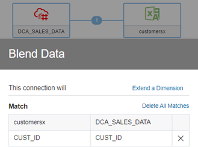

### Objectives

- Connecting Data Sets

### Prerequisites

* An Oracle Cloud Free Tier or Paid account
* You should have completed  
    * Lab 1: Provisioning your Autonomous Database instance
    * Lab 2: Provisioning your Oracle Analytics Cloud instance
    * Lab 3: Connecting OAC to ADW and adjusting Data Set properties
    * Lab 6: Gaining Insights with Visual Data Dialog
    * Lab 7: Monitoring and Ad-hoc scaling up ADW activity for optimal OAC experience
    * Lab 8: Building simple Interactive Analysis

## Task 1: Add Additional Data Set

Lets bring in a new Data Set with Customer demographics to analyze the issue further.

1.  Copy file to your local drive.  
**Download** [customers.xlsx file](https://objectstorage.us-ashburn-1.oraclecloud.com/p/gInS_5IWhulIoFENkRIQdnCA9-IYCDgtnAoxxre95fC7fKUClBft8y15UQA9SUmF/n/idbwmyplhk4t/b/LiveLabs/o/customers.xlsx) and copy it to your local drive.

    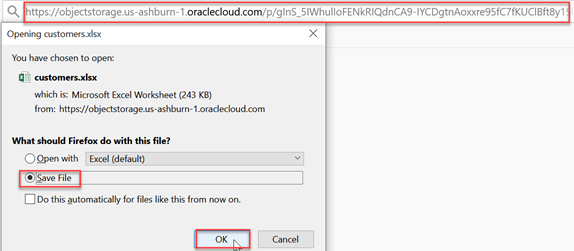

2.  **Add Data Set**.  
Go to Data Pane and Click + icon (Add button) and
Select **Add Data Set...**

    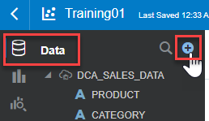

3.  Create Data Set.  
Click **Create Data Set** button, Click 'Drop data file here or click to browse' area and Select the location where you've copied 'customers.xlsx' file.

    Click **Add** button

    

4.  Lets change the properties of the Data Set.  
Set **CUST\_ID** as an **Attribute** so that we can join to our existing Data Set.  
Click on **CUST\_ID** column, go to **General Property Pane** from bottom left, on **Treat As** General Properties change to **Attribute**.

    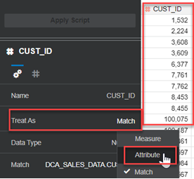

5.  Set **AGE** column as an **Attribute**.  
Click on **AGE** column, go to **General Property Pane** from bottom left, click on the default 'Measure' properties from **Treat As** General Properties and change to **Attribute**.

    

6.  Add the new Data Set.

    Click **Edit Definition** button from top right.  
    Click **Add** button from top right.

    

7.  Recommendations on columns are available for the new Data Set as well.  
Lets enhance the city column with population.  
Select **CITY** column and choose **Enrich CITY with Population** from recommendations.

    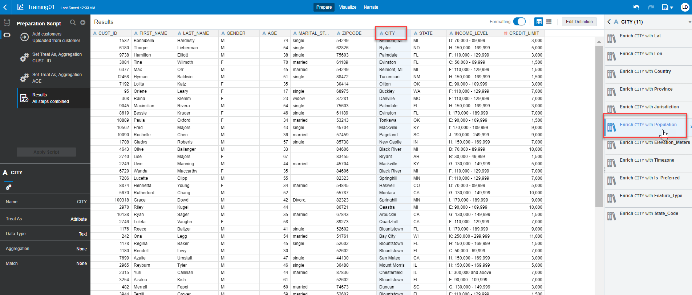

8.  Lets **group** **Income** into **3 bins**.  
_Below 70_ in one group, _70-130_ in another and the last group in _Above 130_.  
Select **INCOME_LEVEL** column, go to **Options** and Click **Group**.

    

9.  First group **Below 70**.  
Type **Below 70** (instead of Group 1) and select A, B and C.

    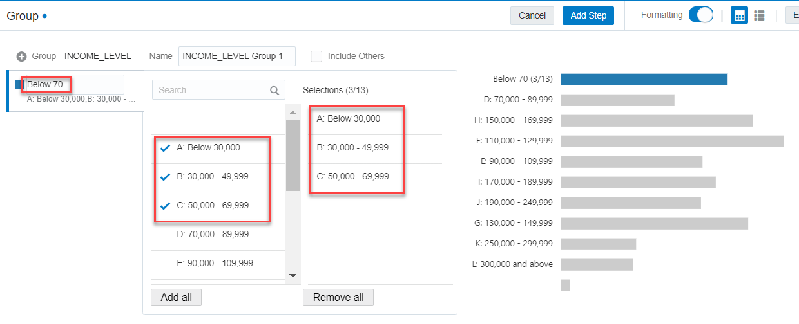

10.  Add second group. 
Click on '+' sign

     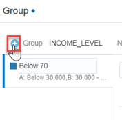

11.  Type group name.  
Type **From 70 to 130**  (instead of Group 2)  and select D, E and F

     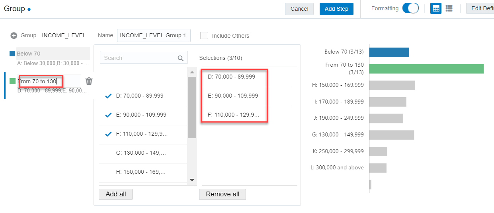

12.  Add third group.  
Click on '+' sign

     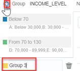

13.  Type group name.  
Type **Above 130**  (instead of Group 3), select **Add All**.

     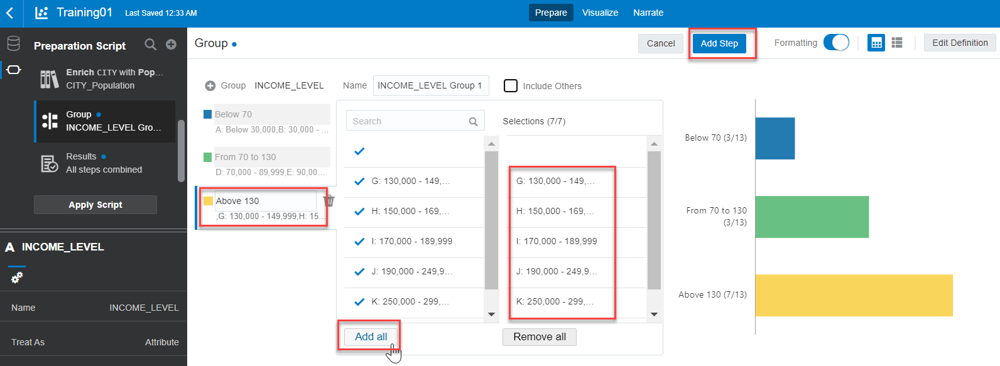

14. Type **Income Group** to Name, Click **Add Step**.

     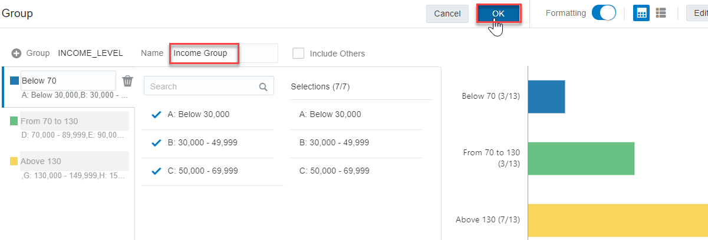

14. Apply Script to activate the changes.  
Click **Apply Script**.

     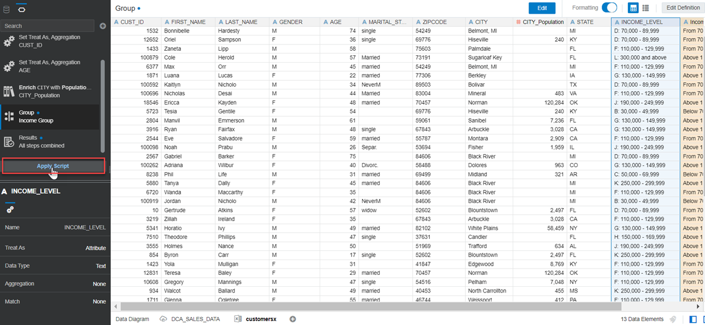

## Task 2: Join the Data Sets

When you add more than one data set to a project, the system tries to find matches for the data that’s added. It automatically matches external dimensions where they share a common name and have a compatible data type with attributes in the existing data set.  
Lets join the Data Sets using **CUST\_ID** as the join condition between the data sets.

1.  Go to **Data** tab.  
In this tab, you can view a representation of the **different datasets** included in the project and their **relationships**.  
Click on **Data** tab

2.  **Connect** Data Sets.  
Currently, there is probably a relationship defined.  
Mouse  hover on the imaginary dotted line **between** the two Data Sets and click on the **1 number** (or **O number**) that will appear.

    

3.  **Blend Data** Sets.  
A **pop-up window** appears allowing you to define a **new relation** between the datasets (join). 

    If **CUST\_ID** already matched go to step 5, otherwise click on **Add Another Match** button.

    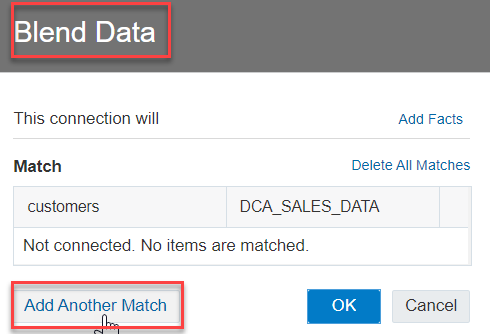

4.  **Blend Data** Sets.  
Select **CUST\_ID**column from both Data Sets.

    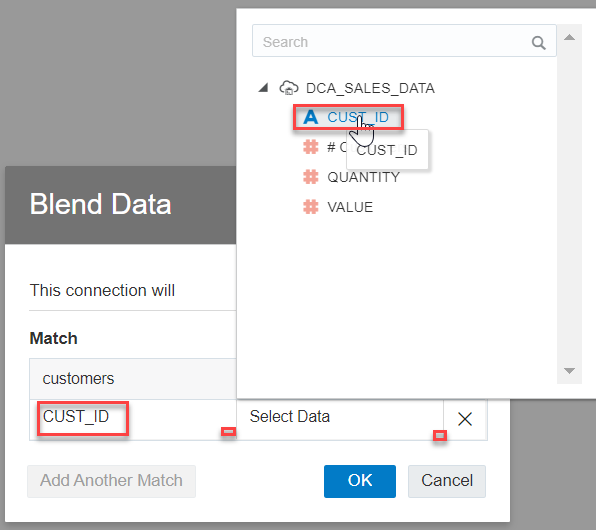

5.  Lets extend the new Data Set as a dimension as the mashup data set doesn't contain any metrics.  
Click **Add Facts** and select **Extend a Dimension**.

    

6.  Click **OK** button.

    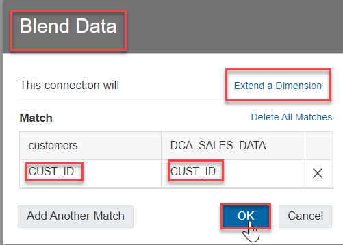

7. Click **Visualize** tab

    

You have just finished learning about data mash-up and various options to connect Data Sets.

You may now [proceed to the next lab](#next)

## Want to Learn More?

* [Blend Data that You Added](https://docs.oracle.com/en/cloud/paas/analytics-cloud/acubi/blend-data-that-you-added.html)
* [About Mismatched Values in Blended Data](https://docs.oracle.com/en/cloud/paas/analytics-cloud/acubi/mismatched-values-blended-data.html)
* [Change Data Blending in a Project](https://docs.oracle.com/en/cloud/paas/analytics-cloud/acubi/change-data-blending-project.html)

## **Acknowledgements**

- **Author** - Lucian Dinescu, Product Strategy, Analytics
- **Contributors** - Sébastien Demanche, Cloud Center of Excellence
- **Reviewed by** - Shiva Oleti, Product Strategy, Analytics
- **Last Updated By/Date** - Lucian Dinescu, April 2021